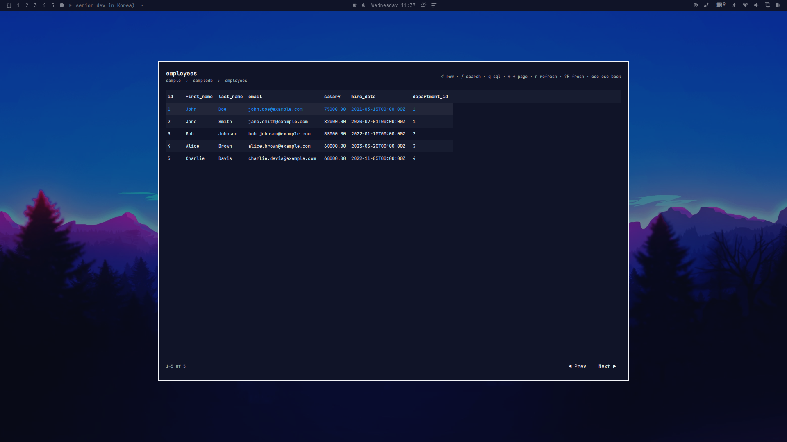

# GoMySQL Peek

<p align="center">
  
</p>

A fullscreen [Omarchy](https://omarchy.org) shell overlay for quickly peeking at
MySQL data — pick a connection, browse databases and tables, page through rows,
search every column, and run read-only SQL queries, all from the keyboard.

```
┌──────────────────────────────────────────────────────────┐
│ employees                                 / search · q … │
│ sample › sampledb › employees                            │
├──────────────────────────────────────────────────────────┤
│ id  first_name  last_name  email      salary  hire_date  │
│ 1   John         Doe        john.doe@…  75000   2021-03… │
├──────────────────────────────────────────────────────────┤
│ 1–5 of 5                              ◀ Prev    Next ▶   │
└──────────────────────────────────────────────────────────┘
```

## How it works

- `engine/` — a small headless **Go** binary (`omysql-engine`,
  [go-sql-driver/mysql](https://github.com/go-sql-driver/mysql)) that speaks
  JSON on stdout. Quickshell has no MySQL client, so this engine is the entire
  data layer: connections, listing, paging, search, and a read-only guard.
- `DbPeek.qml` — an Omarchy shell **overlay plugin** (Quickshell/QML) that
  runs the engine and renders the results.

Connection profiles live in `~/.config/gomysql/connections.json` (override the
path with `GOMYSQL_CONNECTIONS`). The overlay can create, edit, and delete
profiles itself (`n` / `e` / `d`); the format is shared with the
[gomysql](https://github.com/madddtone/gomysql) desktop client. Note that
passwords are stored in plaintext with `0600` permissions on that file.

The engine's keyword guard only passes read-only statements (SELECT, SHOW,
DESCRIBE, EXPLAIN, WITH, ...), single-statement only. Passwords never leave
the engine process; the UI only ever sees name/host/user/database.

## Install

Requirements: an Omarchy system (with `omarchy-shell`), [Go](https://go.dev)
to build the engine, and a reachable MySQL server.

```bash
omarchy plugin add https://github.com/madddtone/omarchy-gomysql-peek.git --enable
~/.config/omarchy/plugins/madddtone.gomysql-peek/install.sh
```

`omarchy plugin add` clones and enables the plugin; `install.sh` builds the
engine to `~/.local/bin/omysql-engine` (the one step the plugin installer
can't do for you).

Then summon it:

```bash
omarchy-shell shell toggle madddtone.gomysql-peek
```

You can also jump straight into a table:

```bash
omarchy-shell shell summon madddtone.gomysql-peek '{"profile":"sample","database":"sampledb","table":"employees"}'
```

### Keybind

In `~/.config/hypr/bindings.lua`:

```lua
o.bind("SUPER + M", "GoMySQL Peek", "omarchy-shell shell toggle madddtone.gomysql-peek")
```

### Bar widget

The plugin also ships a small bar icon (database glyph). When enabled it lands
in the right bar section (pick left/center/right during `omarchy plugin add`)
and opens the overlay on click — handy if you don't use the keybind.

Move it between sections any time:

```sh
omarchy bar move madddtone.gomysql-peek --section center
```

### Menu entry

In `~/.config/omarchy/extensions/omarchy-menu.jsonc`:

```jsonc
"gomysql-peek": { "label": "GoMySQL Peek", "action": "omarchy-shell shell toggle madddtone.gomysql-peek", "aliases": ["gomysql", "mysql", "database"] }
```

### Uninstall

```bash
omarchy plugin remove madddtone.gomysql-peek
rm ~/.local/bin/omysql-engine
```

## Keys

| Key          | Action                                          |
|--------------|-------------------------------------------------|
| ↑ / ↓        | Move selection (PgUp/PgDn ±8, Home/End ends)    |
| ⏎            | Data view: open/close the row's field-value view. Lists: open. SQL/search box: run/apply |
| `y`          | Row detail: yank the focused field's value to the clipboard (wl-copy) |
| type         | Filter the current list — each screen keeps its own filter |
| `/`          | Search all columns of the open table (LIKE)     |
| `q`          | Open the read-only SQL box                      |
| ← / →        | Previous / next page (row detail: previous/next row) |
| `r`          | Refresh what you are viewing (re-runs the query or reloads rows) |
| ⇧R           | Reload the table fresh (drops query + search)   |
| Esc          | Back one level. In the data view press twice (guard against accidental exit) — first press also closes the row detail |
| click outside| Close                                           |

### Managing connections (profiles view)

| Key | Action                                                        |
|-----|---------------------------------------------------------------|
| `n` | New connection form (Enter steps through fields, saves)       |
| `e` | Edit the selected connection (password prefilled)             |
| `d` | Delete the selected connection (with confirmation)            |

Flow: connections → databases → tables → rows.

## Engine CLI

The plugin drives `~/.local/bin/omysql-engine`; you can use it directly too:

```bash
omysql-engine profiles
omysql-engine profile get --name sample          # full profile incl. password
echo '{"name":"prod","host":"db.local","port":"3306","user":"app","password":"secret","database":"shop"}' | omysql-engine profile save
omysql-engine profile remove --name prod
omysql-engine dbs --profile sample
omysql-engine tables --profile sample --db sampledb
omysql-engine rows --profile sample --db sampledb --table employees --limit 50 --offset 0 --search doe
omysql-engine query --profile sample --db sampledb --sql "SELECT id, email FROM employees LIMIT 10"
```

All commands print JSON to stdout and errors to stderr. `--profile` must
match a `name` in `~/.config/gomysql/connections.json` (override the file
location with `GOMYSQL_CONNECTIONS`). `rows` caps pages at 500 rows;
`query` caps results at 500 rows (`--max-rows` up to 5000) and rejects any
statement that is not read-only. `profile save` reads the profile JSON from
stdin so the password never appears on the process command line.

## Security model

- **Credentials:** the overlay sends profiles (password included) to the
  engine over a private stdin pipe, never via argv. `connections.json` lives
  in a `0700` directory owned by you; the engine opens it with `O_NOFOLLOW`,
  verifies it is a regular file owned by you with `0600` permissions (and
  refuses otherwise), and publishes updates atomically (private temp file +
  rename, then re-verified).
- **Read-only SQL:** the free-text query box allowlists `SELECT / SHOW /
  DESCRIBE / EXPLAIN / WITH / VALUES`, rejects `ANALYZE`, blocks
  `INTO OUTFILE / DUMPFILE`, allows a single statement only — and every
  statement additionally runs inside a `READ ONLY` transaction, so the
  server itself rejects anything that would modify data.
- **Resource bounds:** cells truncate at 4096 characters, result sets cap at
  256 columns / 8 MB total output, database calls have a 45 s total deadline
  (plus 5 s connect / 30 s read-write timeouts), and the overlay kills a hung
  engine (SIGTERM, then SIGKILL) after 60 s.

## Development

`./install.sh` only builds the engine to `~/.local/bin/omysql-engine` — it
never touches the plugin files. Sync those with `omarchy plugin update
madddtone.gomysql-peek --yes`, then `omarchy restart shell` (real files
don't hot-reload).

```
manifest.json      plugin manifest (kinds: overlay, bar-widget; id madddtone.gomysql-peek)
DbPeek.qml         the overlay UI
PeekBarWidget.qml  the bar icon that toggles the overlay
Peek.js            parsing/format helpers
engine/            the Go data engine (module gomysql-peek/engine)
install.sh         engine build (plugin files stay managed by omarchy plugin add/update)
```

Note: the widget file must not be named `BarWidget.qml` — that collides with
the shell's `qs.Ui` `BarWidget` type and Qt rejects the entry point with
"File name case mismatch".

## License

[MIT](LICENSE)
